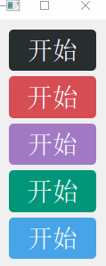

# pyside2_designer_widgets

## 阅前需知

在本存储库中，有些控件最初是其它作者写的（只不过语言不是Python），我（sunchuquin）只是照猫画虎，用Python重写了一遍而已(略有改动，修复错误/增加功能/代码风格/语言特性冲突)，如有侵权，请联系我（QQ:1715216365）。

这些作者是：

1. 飞扬青云(QQ:517216493)
2. ekhumoro([stackoverrun user name](https://stackoverrun.com/cn/q/6014055))

## 依赖库版本
1. PySide2 - 5.15.1

## 演示

### NavBar:

### NavButton:

### NavTitle:

### NavListView:

### CustomSplitter

### ProgressButton

### SwitchButton

### Tumbler

### TumblerDateTime

### ZhToPy

### TelWidget

### Line

### ShadowCalendar

### ShadowClock

### NavLabel

### NavProgress

### ColorButton

### ColorPanelBar

### ColorPanelBtn

### ColorPanelFader

### ColorPanelHSB

### ColorStyle

### ColorWidget

### ColorPanel

### LightButton

